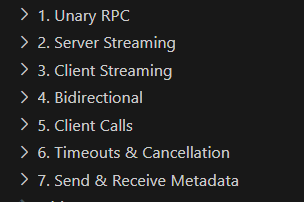
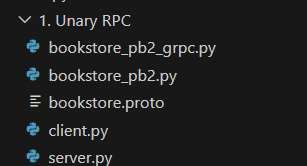

## A hands-on intro with gRPC (Python Usage) 
## Build Docker Image
```
docker build -t py_grpc .
```

## Run Docker Container
```
docker run -d --name py_grpc -v $(pwd):/app py_grpc
```

## Running Server & Client
```
docker exec -it py_grpc bash -c 'python server.py'
docker exec -it py_grpc bash -c 'python client.py'

```
### Note:


Running/providing shell for all these directory quite cumbersome. I suggest running them inside the container from each directory. I will share Unaray RPC as an example.


#### Server
```
$ docker exec -it py_grpc bash
root@d4282de84bb4:/app# cd '1. Unary RPC' 
root@d4282de84bb4:/app/1. Unary RPC# python server.py
```
#### Client
```
$ docker exec -it py_grpc bash
root@d4282de84bb4:/app# cd '1. Unary RPC' 
root@d4282de84bb4:/app/1. Unary RPC# python client.py "The"
```